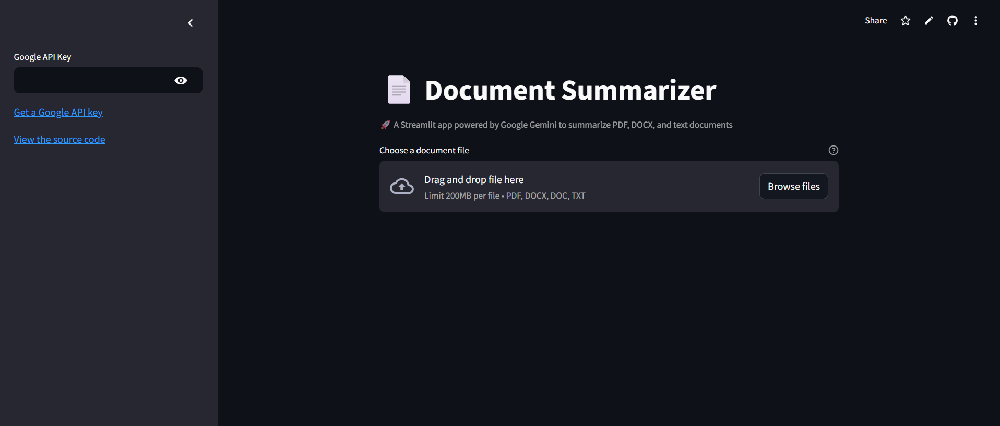
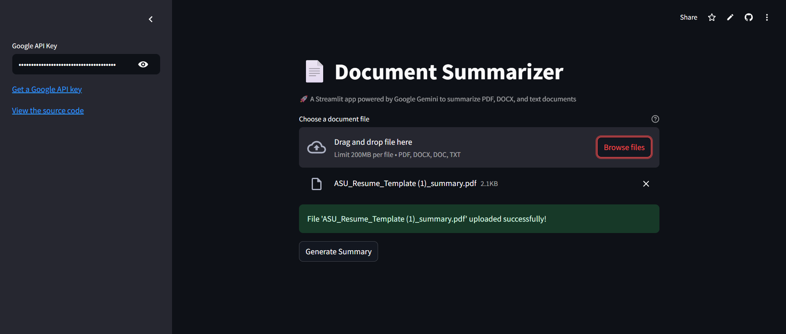
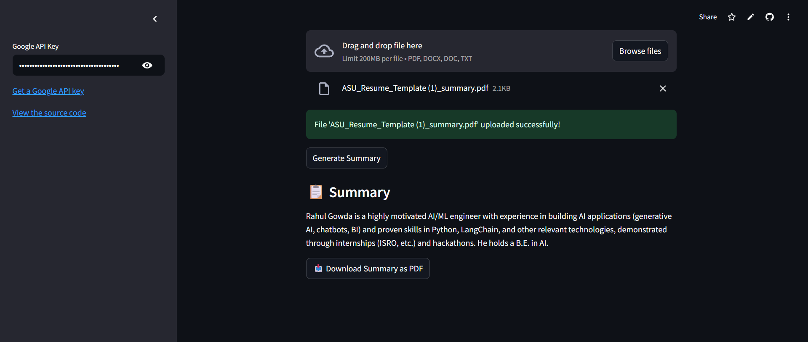
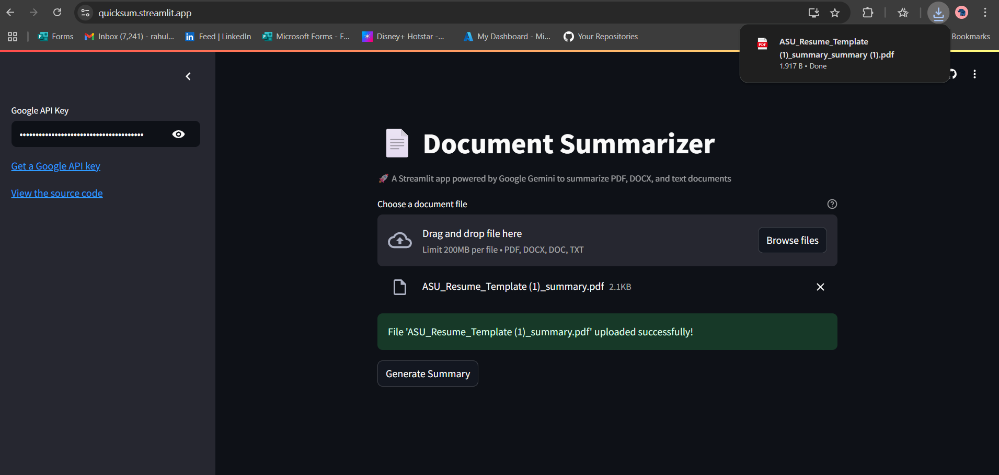

# 📄 Document Summarizer

A powerful Streamlit web application that provides AI-powered summaries of various document formats using Google Gemini AI. Transform lengthy documents into concise, informative summaries with just a few clicks.

🌐 **Live Demo:** [https://quicksum.streamlit.app/](https://quicksum.streamlit.app/)

## ✨ Features

- **Multi-format Support**: Upload and summarize PDF, DOCX, DOC, and TXT files
- **AI-Powered Summaries**: Leverages Google Gemini 1.5 Flash model for high-quality text summarization
- **PDF Export**: Download your summaries as formatted PDF documents
- **User-Friendly Interface**: Clean, intuitive Streamlit web interface
- **Secure**: API keys are handled securely and not stored
- **Fast Processing**: Efficient document chunking and processing for optimal performance

## 📸 Screenshots

### Main Interface


_Clean and intuitive interface for document upload_

### After Document Upload


_Document successfully uploaded and ready for processing_

### Generated Summary


_AI-generated summary with PDF download option_

### Downloaded Summary


_Example of downloaded summary document_

## 🚀 Quick Start

### Prerequisites

- Python 3.8 or higher
- Google API Key ([Get one here](https://makersuite.google.com/app/apikey))

### Installation

1. **Clone the repository:**

   ```bash
   git clone https://github.com/your-repo/PDF_summarize.git
   cd PDF_summarize
   ```

2. **Install dependencies:**

   ```bash
   pip install -r requirements.txt
   ```

3. **Set up environment variables:**
   ```bash
   # Create a .env file and add your Google API key
   echo "GOOGLE_API_KEY=your_api_key_here" > .env
   ```

### Running the Application

```bash
streamlit run app.py
```

The application will open in your default web browser at `http://localhost:8501`

## 📖 Usage

1. **Get API Key**: Obtain a Google API key from [Google AI Studio](https://makersuite.google.com/app/apikey)
2. **Upload Document**: Choose a PDF, DOCX, DOC, or TXT file (supported formats)
   - Maximum file size: 200MB
   - Drag and drop or use "Browse files" button
3. **Enter API Key**: Paste your Google API key in the sidebar
4. **Generate Summary**: Click the "Generate Summary" button
5. **Download PDF**: Optionally download the summary as a formatted PDF

### Example Workflow

1. Visit the application at [quicksum.streamlit.app](https://quicksum.streamlit.app/)
2. Enter your Google API key in the sidebar
3. Upload a document (e.g., `ASU_Resume_Template (1)_summary.pdf`)
4. Click "Generate Summary" and wait for processing
5. View the generated summary and download as PDF if needed

## 🛠️ Technical Details

### Architecture

- **Backend**: Python with LangChain for document processing
- **Frontend**: Streamlit for web interface
- **AI Model**: Google Gemini 1.5 Flash
- **Document Processing**: PyPDF2, Docx2txt, and custom text loaders
- **PDF Generation**: ReportLab for creating formatted summary PDFs

### Supported File Formats

| Format | Extension       | Description              | Max Size |
| ------ | --------------- | ------------------------ | -------- |
| PDF    | `.pdf`          | Portable Document Format | 200MB    |
| Word   | `.docx`, `.doc` | Microsoft Word documents | 200MB    |
| Text   | `.txt`          | Plain text files         | 200MB    |

### Processing Pipeline

1. **Document Loading**: Automatic format detection and appropriate loader selection
2. **Text Chunking**: Recursive character splitting (6500 chars, 400 overlap)
3. **AI Summarization**: Refine chain method for comprehensive summaries
4. **PDF Generation**: Professional formatting with ReportLab

## 🔧 Configuration

### Environment Variables

Create a `.env` file in the project root:

```env
GOOGLE_API_KEY=your_google_api_key_here
```

### Customization Options

- **Chunk Size**: Modify `chunk_size` parameter in `main.py` (default: 6500)
- **Chunk Overlap**: Adjust `chunk_overlap` parameter (default: 400)
- **AI Model**: Change the Gemini model in the `text_summarizer` class

## 📁 Project Structure

```
PDF_summarize/
├── app.py              # Streamlit web interface
├── main.py             # Core functionality and classes
├── requirements.txt    # Python dependencies
├── .env               # Environment variables (create this)
└── README.md          # This file
```

## 🤝 Contributing

1. Fork the repository
2. Create a feature branch (`git checkout -b feature/amazing-feature`)
3. Commit your changes (`git commit -m 'Add amazing feature'`)
4. Push to the branch (`git push origin feature/amazing-feature`)
5. Open a Pull Request

## 📄 License

This project is licensed under the MIT License - see the [LICENSE](LICENSE) file for details.

## 🆘 Support

- **Issues**: Report bugs or request features via [GitHub Issues](https://github.com/your-repo/PDF_summarize/issues)
- **Documentation**: Check this README or code comments
- **API Key Help**: Visit [Google AI Studio](https://makersuite.google.com/app/apikey) for API key assistance

## 🏷️ Tags

`streamlit` `ai` `nlp` `document-processing` `pdf` `summarization` `google-gemini` `langchain` `python`

---

⭐ **Star this repo** if you find it useful!
